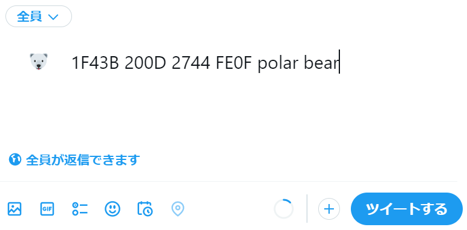

# Unicode tools

Search unicode character and character sequences:

* by character name
* by character code
* by unicode block

This tool depends on unicode 15.0 definition files.

* https://www.unicode.org/Public/15.0.0/ucdxml/ucd.all.flat.zip
* https://www.unicode.org/Public/emoji/15.0/emoji-sequences.txt
* https://www.unicode.org/Public/emoji/15.0/emoji-zwj-sequences.txt

## Usage

### Search by name

```
$ ucsearch goblin
👺 1F47A JAPANESE GOBLIN
```

`ucsearch` prints character, code point or code point sequence, and name or description.

### Search by code

```
$ ucsearch --code 2200-2207
∀ 2200 FOR ALL
∁ 2201 COMPLEMENT
∂ 2202 PARTIAL DIFFERENTIAL
∃ 2203 THERE EXISTS
∄ 2204 THERE DOES NOT EXIST
∅ 2205 EMPTY SET
∆ 2206 INCREMENT
∇ 2207 NABLA
```

### Search by block

```
$ ucsearch --block flag | grep -i norway
🇳🇴 1F1F3 1F1F4 flag: Norway
```

### Applications not supporting complex emoji and zwj sequences

In the case described above, you may see two letters instead of the national flag of Norway in your terminal.


Even if so, when you copy first two letters "🇳🇴" (\u1f1f3\u1f1f4) and paste them in browser, twitter's tweet textbox for example, you can see the national flag of Norway.


The same applies to zwf sequences.




### Options

* ``--strict``: searches characters completely matched (but case insensitive) with specified name.

```
$ ucsearch snowman
☃ 2603 SNOWMAN
☃️ 2603 FE0F snowman
⛄ 26C4 SNOWMAN WITHOUT SNOW
⛇ 26C7 BLACK SNOWMAN
$ ucsearch --strict snowman
☃ 2603 SNOWMAN
☃️ 2603 FE0F snowman
```

* ``--utf8``: prints utf-8 codes instead of utf-32.

```
$ ucsearch goblin
👺 1F47A JAPANESE GOBLIN
$ ucsearch --utf8 goblin
👺 F09F91BA JAPANESE GOBLIN
```

* ``--delimiter`` with delimiter: prints with specified delimiter instead of space (' ').

```
$ ucsearch fireworks
🎆 1F386 FIREWORKS
$ ucsearch --delimiter : fireworks
🎆:1F386:FIREWORKS
$ ucsearch --delimiter=: fireworks
🎆:1F386:FIREWORKS
$ ucsearch -d: fireworks
🎆:1F386:FIREWORKS
```

## Install and initialize tools

Install by `pip3`.

```
$ pip3 install git+https://github.com/mkyutani/unicode-tools.git
```

`uccreatedatabase` command initializes unicode database.

```
$ uccreatedatabase
```

This command creates a file `~/.local/share/applications/unicode.db`, which is an sqlite3 file consuming about 13MB for unicode 15.0.

## Remove tools

`ucdeletedatabase` removes unicode database.

```
$ ucdeletedatabase
```

This command removes `~/.local/share/applications/unicode.db`.

## Print database information

`ucdatabaseinfo` prints database information.

```
$ ucdatabaseinfo
/home/username/.local/share/applications/unicode.db
```
