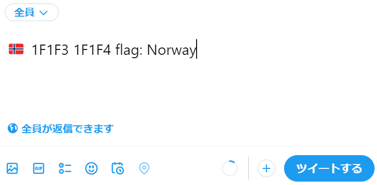
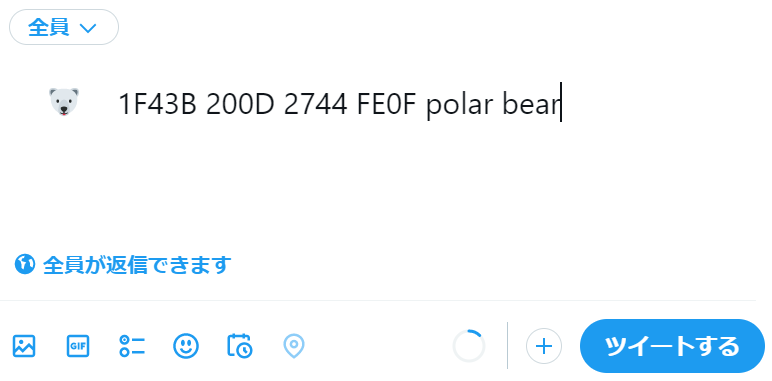

# Unicode Tools (uchr)

[](https://opensource.org/licenses/MIT)
[](https://www.python.org/downloads/)
[](https://unicode.org/)
[](https://badge.fury.io/py/uchr)
[](https://pypi.org/project/uchr/)

A powerful command-line tool for searching and exploring Unicode characters, emoji sequences, and character properties.

## 🚀 Features

- **Search by name**: Find characters by their Unicode name
- **Search by code**: Look up characters by code point or range
- **Search by character**: Reverse lookup from character to details
- **Search by block**: Explore characters within Unicode blocks
- **Emoji support**: Full support for emoji sequences and ZWJ sequences
- **CJK details**: Enhanced descriptions for CJK characters using kDefinition
- **Flexible output**: Multiple output formats for different use cases
- **Text normalization**: Unicode normalization and text conversion utilities

## 📖 Table of Contents

- [Installation](#installation)
- [Quick Start](#quick-start)
- [Usage Examples](#usage-examples)
- [Command Reference](#command-reference)
- [Database Management](#database-management)
- [Text Normalization](#text-normalization)
- [Contributing](#contributing)
- [License](#license)

## 🛠 Installation

### Install from PyPI (Recommended)

```bash
pip install uchr
```

### Install from source

```bash
git clone https://github.com/mkyutani/unicode-tools.git
cd unicode-tools
poetry install
```

### Initialize database

Create the Unicode database (required for first use):

```bash
uchr db create
```

This downloads Unicode 15.0 data and creates a local SQLite database (~13MB) at:
- Linux/macOS: `~/.local/share/uchr/unicode.db`
- Root users: Automatically chooses between system (`/var/lib/uchr/`) or personal location

## ⚡ Quick Start

```bash
# Search for ghost-related characters
uchr search ghost

# Find characters in a code range
uchr search -c 1F47A-1F480

# Search by character
uchr search -x 👻

# Search within a Unicode block
uchr search -b "Emoticons"

# Normalize text
echo "ＨｅｌｌｏＷｏｒｌｄ" | uchr normalize --halfwidth
```

## 📋 Usage Examples

### Search by Name

```bash
uchr search goblin
```
```
👺 1F47A JAPANESE GOBLIN
```

### Search by Code Range

```bash
uchr search -c 1F479-1F47B
```
```
👹 1F479 JAPANESE OGRE
👺 1F47A JAPANESE GOBLIN
👻 1F47B GHOST
```

### Search by Character

```bash
uchr search -x 👻
```
```
👻 1F47B GHOST
```

### Search by Unicode Block

```bash
uchr search -b "Misc_Pictographs"
```

### Search with Details (CJK Characters)

```bash
uchr search -d "pray for happiness"
```
```
祝 795D CJK UNIFIED IDEOGRAPH-#; PRAY FOR HAPPINESS OR BLESSINGS
```

### Output Formatting

```bash
# Simple format (characters only)
uchr search ghost -f simple
👻

# UTF-8 format
uchr search ghost -f utf8
👻 F0 9F 91 BB GHOST

# Custom delimiter
uchr search ghost -D "|"
👻|1F47B|GHOST
```

## 🔧 Command Reference

### uchr

Main command with subcommands for all Unicode operations.

#### uchr search

Search Unicode characters with various criteria.

| Option | Short | Description |
|--------|-------|-------------|
| `--name` | | Search by character name (default) |
| `--code` | `-c` | Search by code point or range |
| `--char` | `-x` | Search by character |
| `--block` | `-b` | Search by Unicode block |
| `--detail` | `-d` | Search in character details |
| `--strict` | `-s` | Exact match (case insensitive) |
| `--first` | `-1` | Show first result only |
| `--format` | `-f` | Output format: `utf8`, `simple` |
| `--delimiter` | `-D` | Custom delimiter (default: space) |

#### uchr normalize

Unicode text normalization and conversion.

| Option | Short | Description |
|--------|-------|-------------|
| `--form` | `-f` | Normalization form: `nfc`, `nfd`, `nfkc`, `nfkd` |
| `--halfwidth` | | Convert fullwidth characters to halfwidth |
| `--detail` | | Show detailed binary representation |
| `--compare` | | Show all normalization forms |

#### uchr db

Database management operations.

| Subcommand | Description |
|------------|-------------|
| `uchr db create` | Create/update Unicode database |
| `uchr db delete` | Remove Unicode database |
| `uchr db info` | Show database location |

## 💾 Database Management

### Create Database
```bash
uchr db create
```

### Check Database Location
```bash
uchr db info
```

### Remove Database
```bash
uchr db delete
```

### Environment Variables

- `UNICODE_DB_PATH`: Override default database location

```bash
export UNICODE_DB_PATH="/custom/path/unicode.db"
uchr db create
```

## 🔤 Text Normalization

The `uchr normalize` command provides Unicode text normalization and conversion utilities.

### Basic Normalization

```bash
# Normalize to NFC (default)
echo "café" | uchr normalize

# Normalize to NFD
echo "café" | uchr normalize --form nfd

# Normalize to NFKC
echo "file" | uchr normalize --form nfkc

# Normalize to NFKD
echo "file" | uchr normalize --form nfkd
```

### Text Conversion

```bash
# Convert fullwidth to halfwidth
echo "ＨｅｌｌｏＷｏｒｌｄ" | uchr normalize --halfwidth

# Show detailed binary representation
echo "café" | uchr normalize --detail

# Compare all normalization forms
echo "café" | uchr normalize --compare
```

### Interactive Mode

```bash
# Read from stdin (interactive)
uchr normalize
# Type text and press Ctrl+D to process
```

## 🌟 Advanced Examples

### Finding Emoji Sequences

```bash
# National flags
uchr search -b "RGI_Emoji_Flag_Sequence"

# Family emoji with ZWJ sequences
uchr search family
```

### Terminal Display vs. Browser/Application Support

Many terminals don't properly display complex emoji sequences, but the characters work correctly when copied to browsers or applications.

#### National Flag Example

When searching for flags, you might see separate letters in your terminal:

```bash
uchr search -b "RGI_Emoji_Flag_Sequence" | grep -i norway
```
```
🇳🇴 1F1F3 1F1F4 flag: Norway
```


Even though you see two separate letters (🇳🇴) in the terminal, when you copy and paste them into a browser or application like Twitter, they combine to display the Norwegian flag 🇳🇴.



#### ZWJ Sequence Example

The same applies to Zero Width Joiner (ZWJ) sequences. Complex emoji like family groups or professional emoji might not render correctly in terminals:

```bash
uchr search "polar bear"
```

In a terminal without proper font support:


But when pasted in Twitter or other applications:



> **💡 Tip**: This is expected behavior. The Unicode data is correct, and the characters will work properly in applications that support modern emoji rendering.

### Pipe Operations

```bash
# Get just the character
uchr search ghost -f simple

# First match only
uchr search snow -1

# Custom format for scripting
uchr search ghost -D "," | cut -d',' -f1
```

### Complex Searches

```bash
# CJK characters with specific meanings
uchr search -d "dragon"

# Characters in multiple blocks
uchr search -b "Mathematical" | head -10
```

## 🏗 Data Sources

This tool uses official Unicode 15.0 data:

- [Unicode Character Database](https://www.unicode.org/Public/15.0.0/ucdxml/ucd.all.flat.zip)
- [Emoji Sequences](https://www.unicode.org/Public/emoji/15.0/emoji-sequences.txt)
- [Emoji ZWJ Sequences](https://www.unicode.org/Public/emoji/15.0/emoji-zwj-sequences.txt)

## 🏗 Development

This project uses [Poetry](https://python-poetry.org/) for dependency management and packaging.

### Development Setup

```bash
# Clone the repository
git clone https://github.com/mkyutani/unicode-tools.git
cd unicode-tools

# Install dependencies
poetry install

# Run tests
poetry run pytest

# Format code
poetry run black src/

# Lint code
poetry run ruff check src/
```

### Building and Publishing

```bash
# Build package
poetry build

# Publish to PyPI (maintainers only)
poetry publish
```

## 🤝 Contributing

1. Fork the repository
2. Create a feature branch (`git checkout -b feature/amazing-feature`)
3. Make your changes and add tests
4. Run the test suite: `poetry run pytest`
5. Format your code: `poetry run black src/`
6. Lint your code: `poetry run ruff check src/`
7. Commit your changes (`git commit -m 'Add amazing feature'`)
8. Push to the branch (`git push origin feature/amazing-feature`)
9. Open a Pull Request

### Code Quality

This project maintains high code quality standards:

- **Type hints**: All functions should include type annotations
- **Testing**: New features should include appropriate tests
- **Documentation**: Update README and docstrings for new features
- **Code style**: Follow Black formatting and Ruff linting rules

## 📄 License

This project is licensed under the MIT License - see the [LICENSE](LICENSE) file for details.

## 🙏 Acknowledgments

- [Unicode Consortium](https://unicode.org/) for maintaining Unicode standards
- [Poetry](https://python-poetry.org/) for modern Python packaging
- Contributors and users of this project

## 📊 Project Status

- **Current Version**: 0.3.0
- **Python Support**: 3.8+
- **Unicode Version**: 15.0
- **Package Name**: `uchr` (on PyPI)
- **Repository**: [mkyutani/unicode-tools](https://github.com/mkyutani/unicode-tools)

For the latest updates and roadmap, see our [GitHub Issues](https://github.com/mkyutani/unicode-tools/issues).
