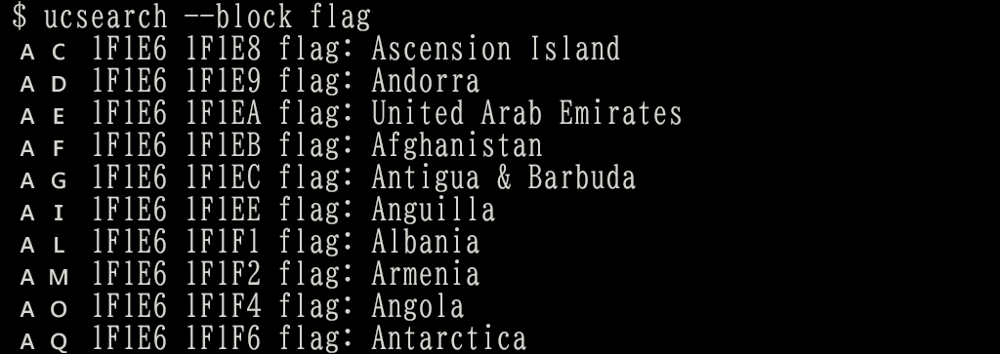
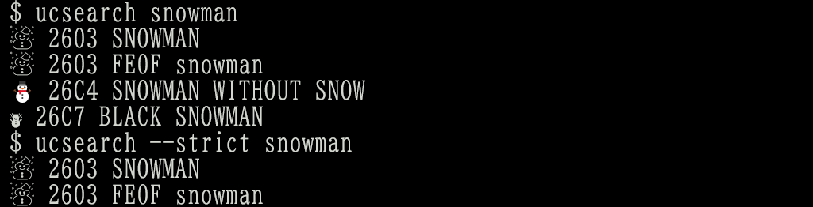
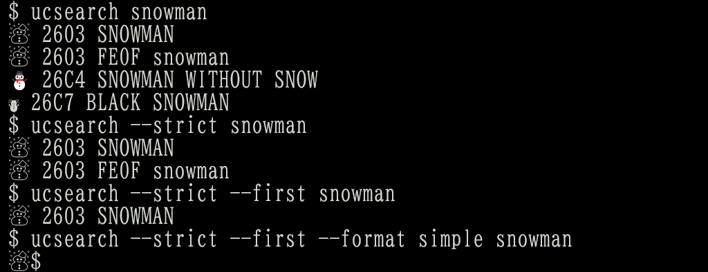

# Unicode tools

Search unicode character and character sequences:

* by character name
* by character code
* by unicode block

This tool depends on unicode 15.0 definition files.

* https://www.unicode.org/Public/15.0.0/ucdxml/ucd.all.flat.zip
* https://www.unicode.org/Public/emoji/15.0/emoji-sequences.txt
* https://www.unicode.org/Public/emoji/15.0/emoji-zwj-sequences.txt

## Usage

### Simple search by name

`ucsearch` searches characters by name in local unicode database created by `uccreatedatabase` (see ), and prints character, code point or code point sequence, and name or description.


### Search by code range

`ucsearch` with `--code` option searches characters by code range and prints result.


### Search by character

`ucsearch` with `--char` option searches characters by character and prints result.


### Search by block name

`ucsearch` with `--block` option search characters by block name and prints result.



### Applications not supporting complex emoji and zwj sequences

In the case described above, you may see two letters instead of the national flag of Norway in your terminal.


Even if so, when you copy first two letters  (\u1f1f3\u1f1f4) and paste them in browser, twitter's tweet textbox for example, you can see the national flag of Norway.


The same applies to zwf sequences.

In terminal without any fonts:


In twitter's tweet textbox:


### Options

### ``--strict``

Searches characters completely matched (but case insensitive).



### ``--format {utf8,simple}``

Prints result in various format.

* 'utf8': Prints utf-8 instead of utf-32.
* 'simple': Prints characters only.  This option may be used in pipe.


### ``--first``

Prints the first result only.  This option may be used in pipe.



### ``--delimiter``

Prints result with the specified delimiter instead of space (0x20).


## Install and initialize tools

Install by `pip3`.

```
$ pip3 install git+https://github.com/mkyutani/unicode-tools.git
```

`uccreatedatabase` command initializes unicode database.

```
$ uccreatedatabase
```

This command creates a file `~/.local/share/applications/unicode.db`, which is an sqlite3 file consuming about 13MB for unicode 15.0.

## Remove tools

`ucdeletedatabase` removes unicode database.

```
$ ucdeletedatabase
```

This command removes `~/.local/share/applications/unicode.db`.

## Print database information

`ucdatabaseinfo` prints database information.

```
$ ucdatabaseinfo
/home/username/.local/share/applications/unicode.db
```
